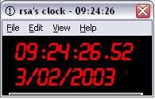



## A Clock \(rsa's clock\)

### Description

It tells the time, and seconds since midnight, with a seconds progress bar and colour changable faces !!!
 
### More Info
 
Watch out for the modules

             |
---                |---
**Submitted On**   |2002-12-16 22:09:44
**By**             |[Elvis Presely](https://github.com/Planet-Source-Code/PSCIndex/blob/master/ByAuthor/elvis-presely.md)
**Level**          |Intermediate
**User Rating**    |4.0 (8 globes from 2 users)
**Compatibility**  |VB 3\.0, VB 4\.0 \(16\-bit\), VB 4\.0 \(32\-bit\), VB 5\.0, VB 6\.0, VB Script
**Category**       |[Miscellaneous](https://github.com/Planet-Source-Code/PSCIndex/blob/master/ByCategory/miscellaneous__1-1.md)
**World**          |[Visual Basic](https://github.com/Planet-Source-Code/PSCIndex/blob/master/ByWorld/visual-basic.md)
**Archive File**   |[A\_Clock\_\(r153873232003\.zip](https://github.com/Planet-Source-Code/elvis-presely-a-clock-rsa-s-clock__1-42919/archive/master.zip)

